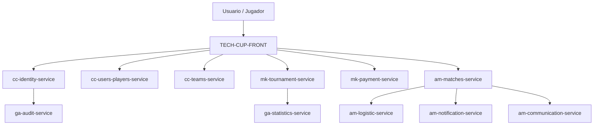

# Documento de Arquitectura

## 1. Introducción

Objetivo y alcance de este documento de arquitectura.

## 2. Estilo arquitectónico

Descripción del estilo general de la solución (p. ej. microservicios) y justificación.

## 3. Vista de contexto

Diagrama y descripción de cómo el sistema TECH CUP 2026 interactúa con actores externos.

## 4. Vista de componentes

| Componente / Repositorio | Responsabilidad | Tecnología |
|---|---|---|
| [TECH-CUP-FRONT](https://github.com/TECH-CUP-2026-INT/TECH-CUP-FRONT) | Interfaz de usuario | |
| [cc-identity-service](https://github.com/TECH-CUP-2026-INT/cc-identity-service) | Autenticación e identidad | Java |
| [cc-users-players-service](https://github.com/TECH-CUP-2026-INT/cc-users-players-service) | Gestión de usuarios y jugadores | Java |
| [cc-teams-service](https://github.com/TECH-CUP-2026-INT/cc-teams-service) | Gestión de equipos | Java |
| [mk-tournament-service](https://github.com/TECH-CUP-2026-INT/mk-tournament-service) | Gestión de torneos | Java |
| [mk-payment-service](https://github.com/TECH-CUP-2026-INT/mk-payment-service) | Procesamiento de pagos | Java |
| [am-matches-service](https://github.com/TECH-CUP-2026-INT/am-matches-service) | Gestión de partidos | Java |
| [am-logistic-service](https://github.com/TECH-CUP-2026-INT/am-logistic-service) | Logística de eventos | Java |
| [am-notification-service](https://github.com/TECH-CUP-2026-INT/am-notification-service) | Notificaciones | Java |
| [am-communication-service](https://github.com/TECH-CUP-2026-INT/am-communication-service) | Comunicación | Java |
| [ga-statistics-service](https://github.com/TECH-CUP-2026-INT/ga-statistics-service) | Estadísticas | |
| [ga-audit-service](https://github.com/TECH-CUP-2026-INT/ga-audit-service) | Auditoría | Java |

## 5. Vista de despliegue

Diagrama de infraestructura y ambientes (desarrollo, staging, producción).

## 6. Vista de datos

Modelo de datos general y estrategia de persistencia por servicio.

## 7. Decisiones de arquitectura (ADR)

| ID | Decisión | Contexto | Estado |
|---|---|---|---|
| ADR-01 | | | |

## 8. Atributos de calidad

| Atributo | Estrategia |
|---|---|
| Seguridad | |
| Escalabilidad | |
| Observabilidad | |
| Resiliencia | |

## 9. Historial de cambios

| Versión | Fecha | Autor | Descripción |
|---|---|---|---|
| 0.1 | | | Versión inicial |
