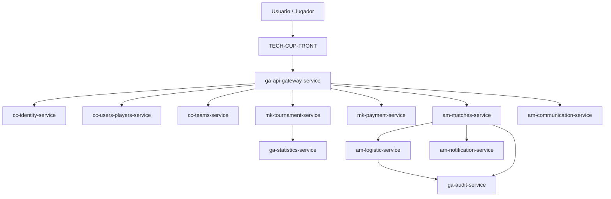

# Documento de Arquitectura

## 1. Introducción

Este documento describe la arquitectura de TECH CUP 2026: cómo se dividen sus
responsabilidades entre microservicios, cómo se integran entre sí, y qué
decisiones y atributos de calidad son transversales a toda la plataforma. El
detalle interno de cada servicio (capas, modelo de datos, endpoints) vive en
su propio repositorio — ver [Back](back.md) y el enlace **Docs** de cada uno
en [Inicio](index.md).

## 2. Estilo arquitectónico

**Microservicios** organizados por dominio funcional (`cc-`, `mk-`, `am-`,
`ga-`, ver [Organización](organizacion.md)), cada uno con su propia base de
datos (MongoDB o PostgreSQL según el servicio) y desplegable de forma
independiente. Un **API Gateway** (`ga-api-gateway-service`, Spring Cloud
Gateway + WebFlux) centraliza el enrutamiento desde el frontend y valida el
JWT una única vez, antes de reenviar la petición al microservicio
correspondiente — los microservicios internos confían en esos claims y no
vuelven a verificar la firma. La integración entre servicios es
mayoritariamente **REST síncrono** para datos maestros/bloqueantes, con
llamadas **best-effort** (fire-and-forget) para trazabilidad no crítica
(auditoría, estadísticas, notificaciones), y **eventos vía RabbitMQ** para dos
tipos de notificación ya publicados en un exchange compartido.

## 3. Vista de contexto

Diagrama y descripción de cómo el sistema TECH CUP 2026 interactúa con actores externos.

## 4. Vista de componentes

| Componente / Repositorio | Responsabilidad | Tecnología |
|---|---|---|
| [TECH-CUP-FRONT](https://github.com/TECH-CUP-2026-INT/TECH-CUP-FRONT) | Interfaz de usuario | React 19 + TypeScript + Vite + Tailwind CSS |
| [ga-api-gateway-service](https://github.com/TECH-CUP-2026-INT/ga-api-gateway-service) | API Gateway: enrutamiento y validación de JWT | Java 21 + Spring Cloud Gateway (WebFlux) |
| [cc-identity-service](https://github.com/TECH-CUP-2026-INT/cc-identity-service) | Autenticación e identidad | Java |
| [cc-users-players-service](https://github.com/TECH-CUP-2026-INT/cc-users-players-service) | Gestión de usuarios y jugadores | Java 21 + Spring Boot + MongoDB |
| [cc-teams-service](https://github.com/TECH-CUP-2026-INT/cc-teams-service) | Gestión de equipos | Java 21 + Spring Boot + MongoDB |
| [mk-tournament-service](https://github.com/TECH-CUP-2026-INT/mk-tournament-service) | Gestión de torneos | Java 21 + Spring Boot + MongoDB |
| [mk-payment-service](https://github.com/TECH-CUP-2026-INT/mk-payment-service) | Procesamiento de pagos (PSE / Mercado Pago) | Java 21 + Spring Boot + PostgreSQL |
| [am-matches-service](https://github.com/TECH-CUP-2026-INT/am-matches-service) | Gestión de partidos en vivo | Java 21 + Spring Boot + MongoDB |
| [am-logistic-service](https://github.com/TECH-CUP-2026-INT/am-logistic-service) | Logística (refrigerios y dotación) | Java 21 + Spring Boot + MongoDB |
| [am-notification-service](https://github.com/TECH-CUP-2026-INT/am-notification-service) | Notificaciones | Java 21 + Spring Boot + MongoDB + RabbitMQ |
| [am-communication-service](https://github.com/TECH-CUP-2026-INT/am-communication-service) | Comunicación (chat, mensajería) | Java 21 + Spring Boot + WebSocket/STOMP + PostgreSQL |
| [ga-statistics-service](https://github.com/TECH-CUP-2026-INT/ga-statistics-service) | Estadísticas | Java 21 + Spring Boot + MongoDB |
| [TECH-CUP-Observability](https://github.com/TECH-CUP-2026-INT/TECH-CUP-Observability) | Observabilidad (métricas, trazas, logs) | Docker Compose + Prometheus + Grafana + Zipkin + ELK |
| ga-audit-service | Auditoría de eventos de la plataforma | Dominio GA — en el roadmap de la organización |

## 5. Vista de despliegue

Diagrama de infraestructura y ambientes (desarrollo, staging, producción).

## 6. Vista de datos

Cada microservicio tiene su propia base de datos — sin base de datos
compartida entre servicios:

| Persistencia | Servicios |
|---|---|
| MongoDB (documentos) | cc-users-players-service, cc-teams-service, mk-tournament-service, am-matches-service, am-logistic-service, am-notification-service, ga-statistics-service |
| PostgreSQL (relacional) | mk-payment-service, am-communication-service |

Los identificadores compartidos entre servicios (`equipoId`, `partidoId`,
`jugadorId`, etc.) se modelan como `UUID` en los servicios revisados, para no
acoplarse a un generador de IDs numérico de otro servicio.

## 7. Decisiones de arquitectura (ADR)

| ID | Decisión | Contexto | Estado |
|---|---|---|---|
| ADR-01 | El JWT se valida una sola vez en el API Gateway; los microservicios internos solo leen sus claims | Evita repetir la verificación de firma en cada servicio y centraliza la política de seguridad | Aceptado |
| ADR-02 | Integraciones no críticas (auditoría, estadísticas, notificaciones) son best-effort (fire-and-forget) | Un servicio externo caído o lento no debe bloquear ni revertir la operación principal del servicio que la origina | Aceptado |
| ADR-03 | Integraciones entre servicios modeladas como puertos + adaptador REST (p. ej. `TorneoClientPort`, `AuditoriaClientPort`) | Permite a cada equipo avanzar su servicio en paralelo, dejando el contrato de integración aislado en un único punto fácil de ajustar | Aceptado |
| ADR-04 | Persistencia por servicio: MongoDB por defecto, PostgreSQL donde el dominio es más relacional (pagos, comunicaciones) | Cada equipo eligió la base de datos según la forma de su propio modelo, no hay estándar único forzado en la plataforma | Aceptado |

## 8. Atributos de calidad

| Atributo | Estrategia |
|---|---|
| Seguridad | JWT emitido por `cc-identity-service`, validado una única vez en el API Gateway; los microservicios internos no deben exponerse directo a internet. Servicio-a-servicio también se autentica con una API key interna compartida en varios servicios del dominio AM. |
| Escalabilidad | Servicios sin estado de sesión en servidor (`STATELESS`); persistencia por servicio para escalar de forma independiente. |
| Observabilidad | Métricas (`/actuator/prometheus` + Grafana), trazas distribuidas (Micrometer Tracing + Zipkin) y logs centralizados (Logback → Logstash → Elasticsearch/Kibana), centralizados en `TECH-CUP-Observability`. |
| Resiliencia | Llamadas best-effort para integraciones no críticas (ver ADR-02); fallo seguro (`502 Bad Gateway`) cuando un servicio externo no responde, documentado explícitamente en `am-logistic-service`. |
| Accesibilidad | El color nunca es el único canal de información — p. ej. cada evento de partido expone un `eventType` explícito (no solo un color), y la propia paleta de esta documentación fue diseñada para cumplir WCAG 2.1 AA. |

## 9. Historial de cambios

| Versión | Fecha | Autor | Descripción |
|---|---|---|---|
| 0.1 | | | Versión inicial |
| 0.2 | 2026-07-17 | | Vista de componentes, ADR y atributos de calidad completados a partir de la documentación real de cada repositorio |
